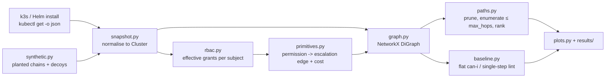

# k8s-privilege-analyzer

Graph-based enumeration of **multi-hop privilege-escalation paths** in Kubernetes RBAC configurations
(Project P17 – *Review 2: implementation and preliminary results*; covers objectives **O1** and **O2**).

Flat review (`kubectl auth can-i`) asks *"may X do Y?"* one permission at a time. This tool builds a graph of the
whole cluster and asks *"can X **become** cluster-admin through a chain of individually reasonable steps?"*

```
pod ──token mount──▶ SA-a ──create pods──▶ SA-b ──read secrets──▶ SA-c ──bind clusterrole──▶ CLUSTER-ADMIN
```

## Quick start
```bash
pip install -r requirements.txt
python run_experiments.py            # reproduces every table + figure in results/  (~30 s)
python analyze.py data/k3s_snapshot  # analyse one snapshot, print top-ranked paths
pytest -q                            # 7 tests
# to capture your own cluster:  bash scripts/collect_k3s.sh data/my_snapshot
```

## Architecture

**Graph model (O1).** Nodes: subjects (ServiceAccount/User/Group), roles, bindings, pods, and one virtual `CLUSTER-ADMIN` target.
*Structure edges* (grey): subject→binding→role. *Escalation edges* (red): derived from permissions and pod specs, each labelled
with a primitive, the permission that enables it, the binding/role it came from, and a difficulty cost.

| Primitive | Needs | Edge to | Cost |
|---|---|---|---|
| HOLDS_ADMIN | `*` on `*` cluster-wide | admin | 0 |
| BIND_CLUSTER_ROLE | create clusterrolebindings + bind | admin | 1 |
| ESCALATE_ROLE | escalate + update clusterroles | admin | 1 |
| IMPERSONATE | impersonate groups/users/SAs | admin / subject | 1 |
| READ_SECRET | get/list secrets in ns | every SA in ns | 1 |
| TOKEN_REQUEST | create serviceaccounts/token | every SA in ns | 1 |
| POD_EXEC | create pods/exec | every pod in ns | 1 |
| TOKEN_MOUNT | pod spec, automount on | pod's SA | 1 |
| CREATE_WORKLOAD | create pods (or patch deployments…) | every SA in ns (mount its token) | 2 |
| NS_BIND | create rolebindings + bind | every SA in ns | 2 |
| CREATE_PRIVILEGED_POD | workload creation in ns without Pod Security Admission | admin (node escape) | 3 |
| POD_ESCAPE | pod spec: privileged / hostPID / hostPath | admin | 3 |

**Enumeration (O2).** Prune to nodes that can reach `CLUSTER-ADMIN`, then `nx.all_simple_paths(entry → target, cutoff=max_hops)`
from every entry point (pods + non-built-in subjects). Ranking: `score = 10 / (1 + Σ step cost)`, ties by fewer hops (groundwork for O3).

## What each file does
| File | Role |
|---|---|
| `analyzer/snapshot.py` | Loads `kubectl` JSON, normalises into `Cluster` (SAs, roles, bindings, pods, PSA level) |
| `analyzer/rbac.py` | Effective permissions: group expansion (`system:serviceaccounts…`), rule matching, scopes, offline `can_i` |
| `analyzer/primitives.py` | The escalation primitives table above; `derive_edges()` |
| `analyzer/graph.py` | Builds the NetworkX graph (structure + escalation layers); `entry_points()` |
| `analyzer/paths.py` | Pruning, bounded path enumeration, cost/score ranking |
| `analyzer/baseline.py` | B1 flat review (`can-i` equivalent), B2 single-step lint |
| `analyzer/synthetic.py` | Generates clusters with planted chains, decoys and noise (same raw format as kubectl) |
| `analyzer/plots.py` | All matplotlib figures |
| `analyze.py` | CLI: analyse one snapshot → ranked CSV + attack-path figure |
| `run_experiments.py` | Runs Exp 1–5, writes `results/` |
| `scripts/collect_k3s.sh` | Dumps RBAC/SA/Pod/Namespace JSON from a live cluster (no Secrets) |
| `tests/test_analyzer.py` | Unit + validation tests |
| `data/k3s_snapshot/` | Real default-k3s export (49 SAs, 7 pods, 62 CRBs) |

## Results (all reproducible with `python run_experiments.py`)

**Real k3s default install** – 235 nodes, 1,341 edges, 21 entry points. Entry points with a route to cluster-admin:
flat review **4**, single-step lint **7**, graph **9**. Findings beyond what flat review shows:
`traefik` SA → read secrets → `helm-traefik` (admin); `local-path-provisioner` can create privileged pods (pods `*` cluster-wide);
`traefik` → read secrets → `clusterrole-aggregation-controller` (escalate). See `results/k3s_paths.csv`, `results/k3s_attack_graph.png`.

**Validation on planted chains** (40 chains, lengths 1–5, 4 terminal types, 5 hop types, decoys + noise):
graph recall **40/40 (100 %)**, false positives **0/240 flagged**, decoys flagged **0/4 per cluster**.
Flat review recall: 25 % at length 1, 0 % beyond. Single-step lint: 100 % at length 1, 0 % beyond. → `validation_recall.png`

**Baseline vs graph** (same clusters, same axes → `baseline_comparison.png`)

| Cluster | Entry pts | Flat | Single-step | Graph |
|---|---|---|---|---|
| k3s (real) | 21 | 4 | 7 | 9 |
| planted-S | 54 | 2 | 6 | 12 |
| planted-M | 189 | 6 | 20 | 60 |
| planted-L | 549 | 10 | 40 | 120 |

**Ablation / sweep** (answers "what causes the gain?")
* *Composition is the cause.* On planted-M, entry points flagged grow with the hop bound 10 → 26 → 38 → 48 → 55 → 59 → 60 (`hop_sweep.png`).
  Same primitives, only chaining differs: 20 (1 hop) → 60. On real k3s coverage saturates at 3 hops (9), while path count keeps exploding (4 → 45 → 586 → 6,361 paths for 1–4 hops), which is why the bound is needed.
* *Primitive coverage.* Removing any one of CREATE_WORKLOAD, NS_BIND, POD_EXEC, READ_SECRET, TOKEN_REQUEST or TOKEN_MOUNT drops planted recall to 0.6; on k3s, removing READ_SECRET drops flagged entries 9 → 7 and TOKEN_MOUNT 9 → 5 (`ablation.png`).
  HOLDS_ADMIN is redundant for recall (an admin can also bind roles), and POD_ESCAPE / CREATE_PRIVILEGED_POD change nothing in the planted set *by design* (all planted namespaces enforce Pod Security `restricted`).
* *Scale.* Runtime grows roughly linearly: ~0.01 s at 217 nodes, ~0.53 s at 10,448 nodes (`scale.png`). Baselines are ~15–25× faster but flag 1.3–3× (single-step lint) or 2–12× (flat review) fewer entry points.

## Threats to validity (what this setup cannot prove)
1. **Self-consistent validation.** Planted chains are authored from the same primitive model the analyser uses, so 100 % recall shows the *implementation* is correct, not that the *model* is complete. Unmodelled primitives (e.g. `nodes/proxy`, admission-webhook edits, `pods/ephemeralcontainers`, CSR approval) give false negatives that no test here can reveal.
2. **Potential, not confirmed, exploits.** No path was executed on a live cluster. READ_SECRET assumes the target SA has a readable token Secret (since K8s 1.24 these are not auto-created); the snapshot omits Secrets, so such edges may be false positives. Privileged-pod escape assumes reachable control-plane credentials and no admission controller beyond PSA labels (OPA/Kyverno not modelled). The false-positive rate on real clusters therefore still needs **manual verification** (planned for Review 3).
3. **One real cluster, default install.** The k3s numbers come from a single snapshot of a near-empty cluster; they are illustrative, not statistically general. Helm-chart results (O4) are not part of this review.
4. **Baselines are emulated.** B1/B2 are re-implemented from the effective-permission engine, not the real `kubectl auth can-i` / KubiScan / rbac-police. B2 uses the same primitives as the graph, so B2-vs-graph isolates the value of *composition*, not of the primitive catalogue.
5. **Entry-point and conservatism choices.** Built-in `system:*` identities are excluded as entry points; rules with `resourceNames` are skipped (possible false negatives); all in-namespace SAs are treated as targets of a pod-create/secret-read.
6. **Synthetic scale test.** The noise namespaces add no extra paths, so runtime reflects graph size, not worst-case path explosion in densely connected clusters (path counts on k3s reach thousands at 4 hops; the sweep caps at 2,000 paths/entry).
7. **Cost weights are heuristic.** Step costs (O3 ranking) are expert estimates and not yet validated against real attacker effort.

## Mapping to the Review-2 rubric
| Criterion | Evidence |
|---|---|
| O1 + O2 (4) | `analyzer/` (git history), `results/graph_structure_demo.png`, `k3s_full_graph.png`, `k3s_attack_graph.png`, `k3s_paths.csv`, `tests/` |
| Comparative results (3) | `results/baseline_comparison.png` and `validation_recall.png` (baseline + proposed on same axes) |
| Ablation / sweep (2) | `results/hop_sweep.png`, `ablation.png`, `scale.png` |
| Threats (1) | section above |
